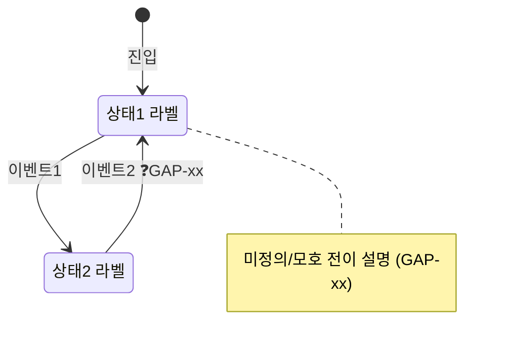
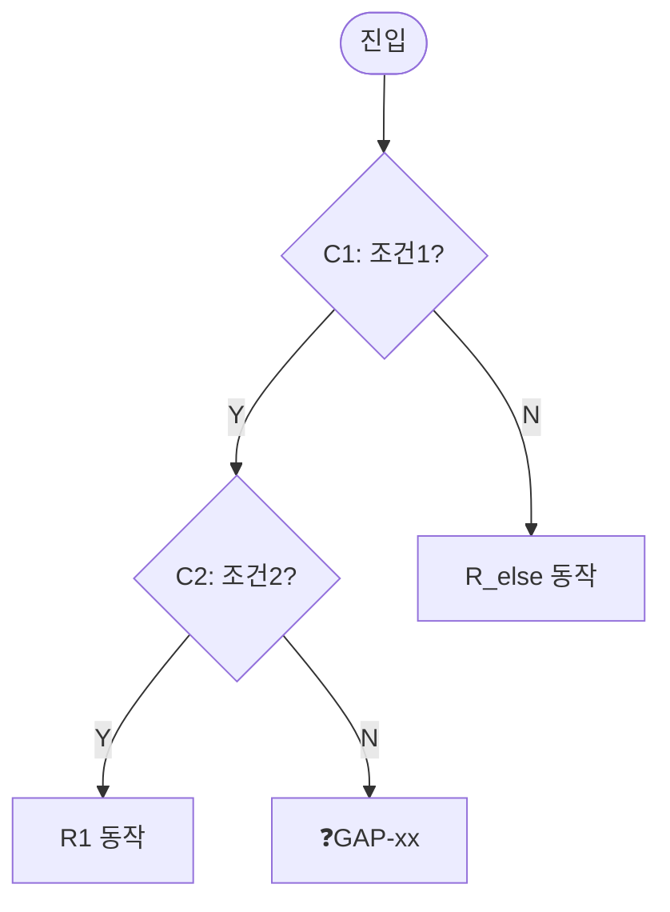

# 스키마 · 갭 분류 · 심각도 · Category 도출법

## 갭 분류 체계

| 분류 | 정의 | 판별 기준 |
|---|---|---|
| 모순 | 두 서술이 양립 불가 | 같은 입력에 서로 다른 결과를 지시하는 두 문장이 PRD에 공존 |
| 누락 | 케이스·상태·필드가 정의 안 됨 | 기법이 도출한 케이스에 대응하는 PRD 서술이 없음 |
| 모호 | 해석이 둘 이상 | 같은 문장을 읽고 기대결과를 2가지 이상으로 단정 가능 |
| 경계미정 | 상·하한·반올림·시점 미정의 | 경계값 TC의 기대결과를 PRD만으로 못 적음 |
| TBD | PRD가 명시적으로 미정 | Open Item·"확인 필요"·`[TBD]` 등 PRD가 스스로 미결로 표기 |

> 이미 PRD에 명시된 미결(Open Items, "BE 확인 필요" 등)은 갭으로 편입하되 설명 앞에 **`[기인지]`** 태그를 붙여 신규 발견과 구분한다.

## 심각도 기준

> `예(유형)` 열은 도메인 중립. 구체 사례는 맨 아래 **부록** 참고(역수입 금지).

| 심각도 | 기준 | 예(유형) |
|---|---|---|
| High | 배포 차단 · 데이터/상태 정합성 오류 · 중복/누락 처리 · 복구 불가 | 모순으로 구현 불가, 데이터·카운트 중복/누락 |
| Med | 합의 필요 · UX 분기 미정 · 우회 가능하나 혼란 | 합의 없이 진행 시 갈리는 화면·안내 분기 |
| Low | 문구·표기·메시지 수준 | 거부/안내 메시지 문구 미정 |

## 빈 템플릿 4종

**TC 표 (7열)** — TC-ID 형식 `US01-T01`(요소코드+연번), 화면상태 전용은 `S1B-T01` 가능:

| TC-ID | Category | Summary | 전제조건 | 단계 | 기대결과 | 적용기법 |
|---|---|---|---|---|---|---|
|  |  |  |  |  |  |  |

**갭 리포트 (3단: 색인 표 + 상세블록 + 도식 섹션)** — GAP-ID 형식 `GAP-01`(문서 전역 연번), 분류 ∈ {모순·누락·모호·경계미정·TBD}, 심각도 ∈ {High·Med·Low}.

*1단 — 색인 표 (심각도순, 6열, 스캔용):*

| GAP-ID | 위치 | 기법 | 분류 | 심각도 | 한줄요약 |
|---|---|---|---|---|---|
|  |  |  |  |  |  |

*2단 — GAP별 상세블록 (색인의 각 GAP-ID와 1:1, 하이브리드 표):*

서술 5필드는 세로 2열 표, `처분`은 표 밖 편집줄로 분리(처분은 PM이 직접 체크/사유 입력 → 표 셀 편집은 파이프 정렬이 깨져 불편 + carry-forward 수확이 라인을 파싱). 셀 내 다중문장(①② 열거 포함)은 `<br>`로 줄바꿈:

### GAP-NN  〈분류〉·〈심각도〉·〈기법〉
| 항목 | 내용 |
|---|---|
| 위치 | [L# 〈섹션약기호〉](〈base풀URL〉#〈앵커〉) … (L-토큰은 헤더 L#→URL 맵 base에 step1 앵커규칙으로 **섹션 딥링크**; 매칭 불확실 시 페이지 레벨 폴백. 섹션약기호는 링크 텍스트에 남겨 위치표시) |
| 현황 | (PRD가 실제로 말하는 사실) |
| 문제점 | (왜 갭인가 — 리스크/공백) |
| PM 질문/제안 | … |
| 관련 TC | 〈TC-ID〉 (TC 파일 참조) · 도식 있으면 `→ M2 도식 참조` |

처분: ☑유지(기본)  ☐제외(사유: ___)  ☐오판정(사유: ___)

처분 의미 — **제외**: 갭 실재하나 PM 미반영(의도된 동작/범위 외/리스크 수용) · **오판정**: 엔진 오검출(가짜 갭). 둘 다 사유 필수. 재실행 시 결번 색인 이월(아래 "회차/버전 템플릿").

*3단 — ST/DT 도식 섹션:* 상태전이 Mermaid 상태도(각 `❓`=GAP 캡션)·결정 매트릭스 사본(각 `❓`·`⚠️`=GAP 캡션)을 **독립 섹션**으로 싣는다. 여러 GAP을 가로지르는 엔티티 모델이라 상세블록에 흡수하지 않고, 상세블록에서 `→ M2 도식 참조`로 교차링크(전이표 전체·완전 매트릭스는 TC 파일).

**위치 링크 — 섹션 딥링크 규칙:** 위치 토큰은 헤더 메타 `대상 PRD`의 L#→URL을 base로 섹션 헤딩 앵커까지 딥링크한다.
- 앵커 = 헤딩텍스트의 공백 → `-` 치환, 비ASCII는 UTF-8 퍼센트인코딩, 점(`.`) 보존. 딥링크 = `<base풀URL>#<앵커>`.
- base URL은 입력 URL의 타이틀 슬러그를 보존한 풀URL(`.../pages/<id>/<슬러그>`).
- 헤딩이 아닌 토큰(표 행·하위항목)은 가장 가까운 상위 헤딩 앵커에 태움. 매칭 불확실 시 페이지 레벨 폴백(프래그먼트 없음).
- 검증 예: `### 2-1. 리워드 체계` → `#2-1.-%EB%A6%AC%EC%9B%8C%EB%93%9C-%EC%B2%B4%EA%B3%84`.
- **취약성:** 앵커는 분석 version에 고정 — 헤딩 rename 시 깨지고 페이지 상단으로 폴백. GAP 헤더 메타에 한 줄 캡션으로 명기.

**커버리지 매트릭스 (행=요소군 × 열=7기법)** — 셀 = `TC수/갭수`. 두 TC가 같은 셀에서 동일 커버리지 대상에 매핑되고 추가 변별력이 없으면 병합한다(양산 방지 — `references/techniques.md` "TC 양산 방지 규칙"):

| 요소군 \ 기법 | 동등분할 | 경계값 | 결정테이블 | 상태전이 | 페어와이즈 | 유스케이스 | 오류추측 |
|---|---|---|---|---|---|---|---|
|  |  |  |  |  |  |  |  |

**상태전이 모델 (전이표 + Mermaid 상태도)** — 상태·라이프사이클 엔티티마다 1세트. 셀 = 다음상태/동작 · `–`(발생 불가) · `❓→GAP-xx`(미정의·모호). 규격은 `references/techniques.md` "상태전이(ST) 산출물" 참조:

| 현재상태 \ 이벤트 | (이벤트1) | (이벤트2) | … |
|---|---|---|---|
| (상태1) |  |  |  |
| (상태2) |  |  |  |



**결정 매트릭스 (조건×규칙)** — 둘 이상 조건이 결합되는 정책마다 1세트. 행=조건/동작, 열=규칙(R1, R2, …). 셀 = 값/`Y`/`N` · `–`(무관) · `❓→GAP-xx`(동작 미정의) · `⚠️→GAP-xx`(규칙 충돌). 조건 ≥3개 또는 분기가 비대칭이면 아래 Mermaid `flowchart`를 곁들임. 규격은 `references/techniques.md` "결정테이블(DT) 산출물" 참조:

| 조건 / 규칙 | R1 | R2 | R3 | … | R_else |
|---|---|---|---|---|---|
| C1: (조건1) |  |  |  |  | – |
| C2: (조건2) |  |  |  |  | – |
| C3: (조건3) |  |  |  |  | – |
| → 동작 |  |  |  |  |  |
| → TC-ID |  |  |  |  |  |
| → GAP-ID |  |  |  |  |  |



## Category 통제 어휘 도출법

> PRD의 기능 분해 단위(유저스토리 묶음 / 화면군 / 정책 영역)에서 5~10개의 상호배타적 기능 버킷을 추출한다. 화면 URL 그룹·US 제목·정책 섹션이 1차 후보다. 값 목록은 PRD별로 다르다.

## 회차/버전 템플릿 (재실행 추적)

**산출물 헤더 메타 블록 (TC·GAP 두 파일 최상단)** — 1회차도 회차·PRD 버전은 기록. 다중 PRD면 `대상 PRD` 줄을 pageId별로 반복:

```
> **분석 회차**: N회차 (YYYY-MM-DD)
> **대상 PRD**: L<#> · pageId <숫자> · version v<k> · lastModified <YYYY-MM-DD> · [링크](<풀URL: .../pages/<숫자>/<슬러그>>)
> _위치 링크 앵커는 위 version 기준 헤딩에 고정 — 헤딩명 변경 시 페이지 상단으로 폴백._
> **이전 회차**: (N-1)회차 (YYYY-MM-DD, pageId <숫자> v<j>) → `doc/_archive/<YYYY-MM-DD>/`
```
1회차면 `이전 회차` 줄은 `> **이전 회차**: — (최초)`.

다중 PRD면 `대상 PRD` 줄을 페이지별로 반복하며, 각 줄의 `L<#>`(분석 중 부여한 레이어 라벨)·`[링크]`가 본문 위치 약기호의 L-토큰 하이퍼링크가 해소되는 **L#→URL 맵**이다.

**「변경 이력」 + 「결번 색인」 (GAP 파일 전용)** — 재실행(2회차+)이면 둘 다 **필수** 섹션(회차간 diff = 1급 산출물). GAP 파일 말미에 싣는다:

```
## 변경 이력
### N회차 (YYYY-MM-DD, pageId <숫자> v<j>→v<k>)
- ✅ 해결: GAP-xx (한줄) — 결번 색인으로 이동
- 🔁 재발: GAP-yy (한줄) — 원 ID 재사용, 색인에서 복귀
- 🆕 신규: GAP-zz (한줄)
- 🚫 제외: GAP-zz (사유) — 결번 색인으로 이동 (PM 미반영·갭 실재)
- 🚫 오판정: GAP-vv (사유) — 결번 색인으로 이동 (엔진 오검출)
- ➖ 잔존: GAP-aa, GAP-bb …

## 결번 색인 (해결/제외/오판정된 GAP)
- GAP-xx: [해결 YYYY-MM-DD · pageId <숫자> v<k>] 한줄 설명
- GAP-yy: [제외 YYYY-MM-DD · pageId v<k>] 사유 (PM 미반영 — 갭 실재)
- GAP-ww: [오판정 YYYY-MM-DD] 사유 (엔진 오검출)
```

GAP-ID 규칙: 회차 가로질러 불변 · 잔존=같은 ID 유지 · 해결=메인 표에서 제거 후 색인 stub · 재발=원 ID 재사용(색인 stub 제거 후 메인 복귀) · 신규=직전까지 쓰인 최대 ID+1(결번 안 메움) · 제외/오판정=해결과 동일(메인 표·상세블록에서 제거 후 색인 stub) · 재개=재발 레일(색인 stub 제거 후 메인 복귀).

---

## 부록 — 한 도메인 심각도 예시 (참고용, 역수입 금지)

> 차별화리뷰Pro 추천인코드 PRD 사례일 뿐. 새 PRD엔 끌어오지 말 것.

| 심각도 | 그 PRD 예 |
|---|---|
| High | 할인 중복 적용, 리워드 미정으로 배치 구현 불가 |
| Med | 교차기기 안내 부재, 덮어쓰기 경고 |
| Low | 소수 입력 거부 메시지 미정의 |
