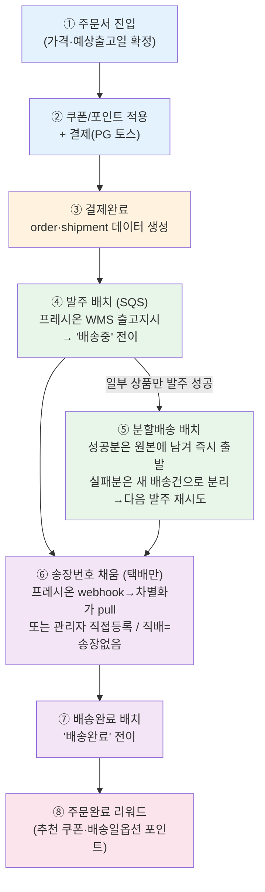
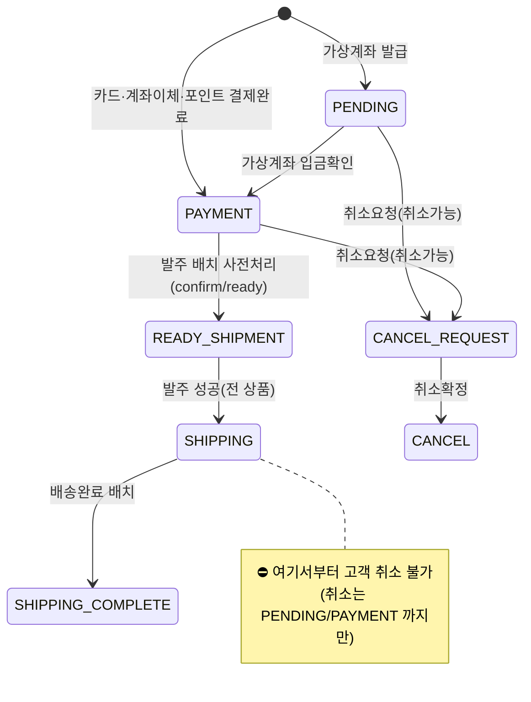
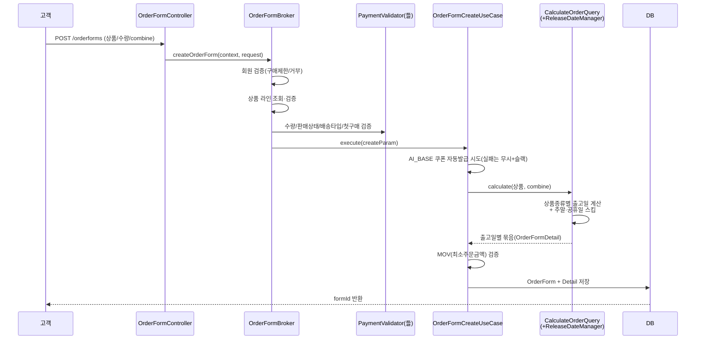
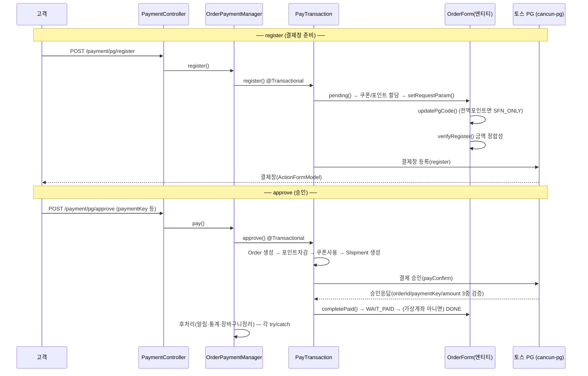
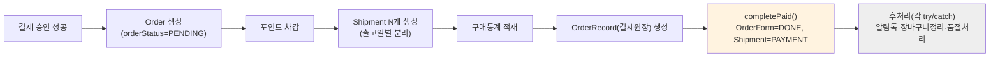
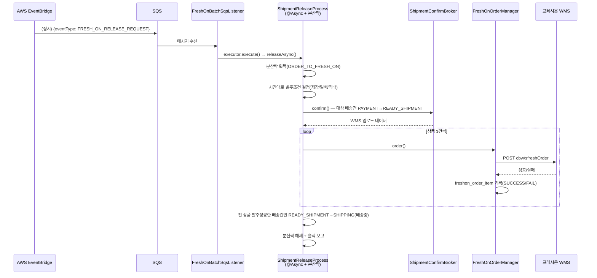
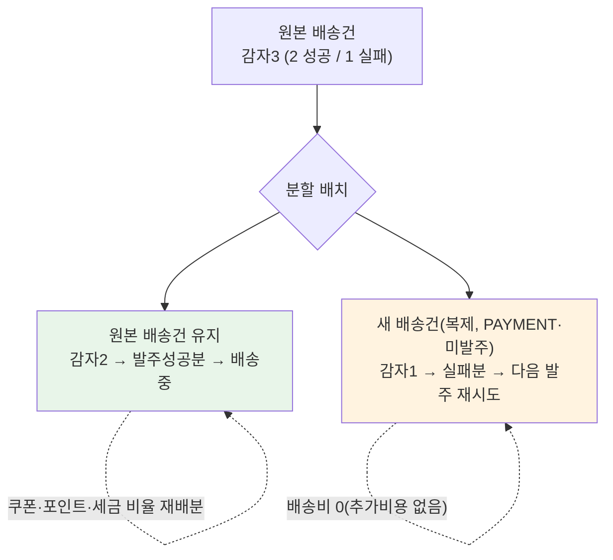
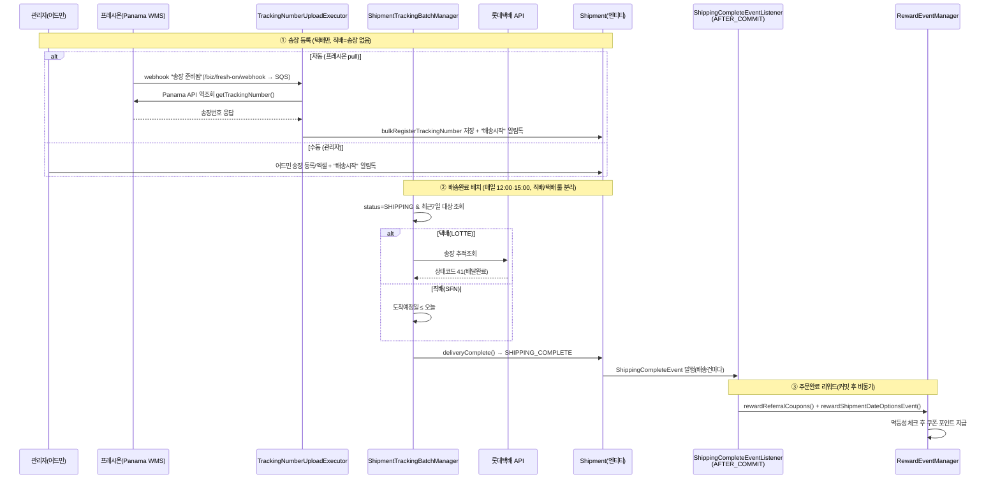
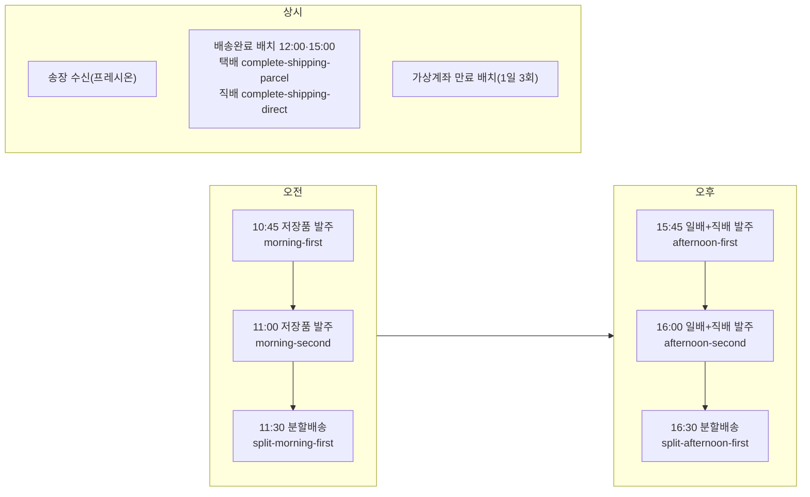

# 주문 → 결제 → 발주 → 배송 인수인계 문서

> **작성일**: 2026-06 · **대상 도메인**: order / payment / pg / release(발주) / shipment(배송)
> **대상 독자**: 개발 · 운영 · 기획 · CS
> **범위**: 고객이 주문서에 진입한 순간부터 → 결제(쿠폰/포인트/PG 토스) → 주문·배송 데이터 적재 → 발주 배치(프레시온 WMS) → 분할배송 → 송장 트래킹 → 배송완료 → 주문완료 리워드 지급까지의 전체 흐름과 정책. 

---

## 0. 이 문서 읽는 법

- 각 단계마다 **🟢 한눈에** → **다이어그램** → **🔧 상세 로직(`파일:라인`)** → **📋 정책** 순서로 구성했습니다.
- 빠르게 흐름만 보려면 **0~1장 + 각 단계의 🟢/다이어그램/📋 정책**만 읽어도 전체 그림이 잡힙니다.
- 다이어그램은 [Mermaid](https://mermaid.js.org)입니다. GitHub PR/위키, IntelliJ, VS Code, Typora 등에서 렌더링됩니다.
- 코드 근거는 `파일경로:라인` 형식입니다. (`/bin/` 경로는 빌드 산출물이므로 무시하고 `src/main` 기준)

### ⚠️ 가장 먼저 알아둘 3가지

1. **상품은 3종류로 나뉘고, 종류마다 발주·배송 방식이 다릅니다.**
   - **저장품(STORED)** — 우리 물류센터에 **재고로 보관**하는 일반상품. 택배(롯데) 배송. **오전 발주**.
   - **일배품(CROSS)** — 물류센터에 **보관하지 않고**, 발주가 들어오면 **외부 협력사에 요청해 받아오는** 상품(크로스도킹). 택배(롯데) 배송. **오후 발주**. 협력사 입고에 시간이 걸려 출고가 상품 속성만큼 며칠 늦어질 수 있으나, **현재 차별화상회 일배품은 모두 D+1(발주 다음 영업일 출고)** 상품입니다.
   - **직배(DIRECT)** — 자체배송(SFN). **오후 발주**. 출고일 = 도착일.
2. **발주 배치 시각(10:45, 11:00, 15:45, 16:00 등)은 코드가 아니라 AWS EventBridge(인프라)에 설정**돼 있습니다. 실제 룰 이름은 5·9장에 정리. 코드는 "지금 몇 시인지"로 무엇을 발주할지 역산합니다. → 시각 변경은 **인프라(EventBridge)**, 대상 상품 매핑 변경은 **코드**.
3. **하나의 주문이 여러 "배송 건(shipment)"으로 쪼개집니다.** 출고일이 다르면 자동으로 분리됩니다. 그래서 부분배송이 생기고, 부분배송만 완료돼도 주문완료 리워드가 나갑니다.

---

## 1. 전체 여정 한눈에

### 🟢 한눈에

> 고객이 **주문서**를 만들면 시스템이 가격·출고일을 확정합니다 → 고객이 **쿠폰/포인트**를 적용하고 남은 금액을 **카드/계좌/가상계좌(토스 PG)** 로 결제합니다 → 결제가 끝나면 **주문(order)과 배송 건(shipment)** 데이터가 쌓입니다 → 정해진 시각에 **발주 배치**가 돌아 프레시온 창고(WMS)에 출고지시를 보내고 배송 건을 **'배송중'** 으로 바꿉니다 → 택배는 **송장번호**가 채워지고(직배는 송장 없음) → 도착일에 **배송완료 배치**가 '배송완료'로 바꾸며 → **주문완료 쿠폰/포인트**를 지급합니다.



### 상태(Status) 매핑 — 한 주문이 거치는 3개의 상태축

한 주문에는 **서로 다른 3개의 상태 enum**이 동시에 존재합니다. 혼동하기 쉬우니 표로 정리합니다.

| 단계             | 주문서 `OrderFormStatus` | 주문 `Order.OrderStatus`                | 배송 `ShipmentStatus`       |
| -------------- | --------------------- | ------------------------------------- | ------------------------- |
| 주문서 생성         | `CREATED`             | (없음)                                  | (없음)                      |
| 결제창 진입         | `PENDING`             | (없음)                                  | (없음)                      |
| **결제완료(카드 등)** | `DONE`                | `PAYMENT`                             | `PAYMENT`(결제완료)           |
| 결제완료(가상계좌 미입금) | `WAIT_PAID`           | `PENDING`                             | `PENDING`(입금대기)           |
| 가상계좌 입금확인      | `DONE`                | `PAYMENT`                             | `PAYMENT`                 |
| 발주 직전(배치 사전처리) | `DONE`                | `PAYMENT`                             | `READY_SHIPMENT`(배송준비)    |
| **발주 성공**      | `DONE`                | `PAYMENT`                             | `SHIPPING`(배송중)           |
| **배송완료**       | `DONE`                | `PAYMENT`                             | `SHIPPING_COMPLETE`(배송완료) |
| 취소             | -                     | `CANCEL_COMPLETED`/`PARTIAL_CANCELED` | `CANCEL_REQUEST`→`CANCEL` |

- `OrderFormStatus`(주문서) = 결제 진행 관점. 값: `CANCEL_*` 없음. (`OrderForm.kt:634`)
- `Order.OrderStatus`(주문) = 취소/정산 관점. 값: `PENDING, PAYMENT, CANCEL_COMPLETED, PARTIAL_CANCELED`. (`Order.kt:177`)
- `ShipmentStatus`(배송) = 물류 진행 관점. 값 8종. (`cancun-shared/.../type/ShipmentStatus.kt`)



> ⚠️ **주의(개발자)**: `ShipmentStatus`가 **두 곳**에 정의돼 있습니다. ① `cancun-shared/.../type/ShipmentStatus.kt`, ② `Shipment` 엔티티 내부 nested enum `Shipment.ShipmentStatus`(`Shipment.kt:527`). **엔티티가 실제 쓰는 건 ②(nested)** 이며 `isCancelAcceptable()` 같은 헬퍼가 추가돼 있습니다. 값은 동일하니 추가 시 양쪽 동기화 필요.

### 용어 사전 (짧게)

| 용어                 | 의미                                                                   |
| ------------------ | -------------------------------------------------------------------- |
| **주문서(OrderForm)** | 결제 전 장바구니 스냅샷. `form_id`가 주문번호의 뿌리                                   |
| **주문(Order)**      | 결제완료로 확정된 주문. `orderNumber = form_id` 동일 키 유지                        |
| **배송 건(Shipment)** | 한 주문이 출고일별로 쪼개진 실제 배송 단위                                             |
| **발주(Release)**    | 프레시온 창고(WMS)에 "이 상품 출고하라"고 지시하는 것                                    |
| **프레시온 WMS**       | 외부 창고관리시스템. `freshOnOrderClient`로 발주 API 호출 (`POST cbw/sfreshOrder`) |
| **PG**             | 결제대행. 현재 **토스페이먼츠** 사용 (`cancun-pg` 모듈)                              |
| **MOV**            | 최소주문금액(Minimum Order Value)                                          |

---

## 2. 1단계 — 주문서 진입 & 예상 출고일

### 🟢 한눈에

> 고객이 상품을 담고 주문서를 만들면(`POST /orderforms`), 시스템은 회원·상품·수량·판매상태를 검증한 뒤 **상품 종류(저장/일배/직배)와 주문한 시각의 마감시간**을 따져 **예상 출고일**을 계산합니다. 출고일이 다른 상품은 자동으로 별도 배송 묶음이 됩니다. **직배는 출고일=도착일**("내일 오전"), **택배(저장/일배)는 출고일=배송 출발일**("내일 12/20")입니다.

### 시퀀스



### 🔧 상세 로직

| 역할 | 위치 |
|------|------|
| 엔드포인트 `POST /orderforms`, `GET /orderforms/{no}` | `api-rest/.../controller/front/order/OrderFormController.kt:33,45` |
| 생성 Broker | `api-rest/.../provider/front/order/OrderFormBroker.kt:28` |
| 생성 트랜잭션(UseCase) | `order-domain/.../order/OrderFormCreateUseCase.kt:20` |
| 출고일 계산 진입 | `order-domain/.../order/CalculateOrderQuery.kt` |
| 출고일 엔진 | `order-domain/.../order/schedule/CarStarFireReleaseDateManager.kt:29` |
| 마감시간 정책 | `order-domain/.../order/schedule/OrderScheduleDeadLineQuery.kt:9` |
| 휴일/주말 스킵 | `order-domain/.../order/holiday/PublicHolidayManager.kt:74` |
| 응답 DTO | `order-domain/.../shared/dto/OrderFormResponse.kt` |
| 출고/도착 문구(직배) | `order-domain/.../order/schedule/message/DirectDeliveryDateMessageService.kt` |
| 출고/도착 문구(택배) | `order-domain/.../order/schedule/message/ParcelDeliveryDateMessageService.kt` |

**출고일 계산 흐름** (`CarStarFireReleaseDateManager.calculateWithSkipDay`, line 121):
1. 주문 시각이 마감시간 전/후인지 판정(`getBasicTime`, line 336) → `release_schedule` 테이블에서 가산일(리드타임) 조회
2. `후보출고일 = 주문일 + 가산일`
3. `holidayManager.skipHoliday()` 로 주말·공휴일 건너뜀
4. 직배 + 특정업체 스케줄이면 업체 가능요일 검증, 안 맞으면 재계산(최대 3회, 초과 시 슬랙+예외)

### 📋 정책 — 예상 출고일

| 항목 | 저장품(STORED) | 일배품(CROSS) | 직배(DIRECT) |
|------|----------------|----------------|--------------|
| 재고 보관 | 우리 물류센터 보관 | **미보관**(발주 시 외부 협력사에서 입고) | 협력사 직배송 |
| 배송 방식 | 택배(롯데) | 택배(롯데) | 자체배송(SFN) |
| **마감(컷오프) 시간** | **오전 11시** | **오후 4시** | **오후 4시** |
| 마감 넘기면 | 출고일 하루 뒤로 | 출고일 하루 뒤로 | 출고일 하루 뒤로 |
| 입고 리드타임 | 즉시(보관 중) | 상품 속성별 D+n (**현재 차별화는 D+1만**) | - |
| 주말 휴무 | 토·일 | 토·일 | **일요일만**(토 출고 가능) |
| 출고일 vs 도착일 | 출고일 = **배송 출발일** | 출고일 = **배송 출발일** | 출고일 = **도착일** |
| 고객 노출 문구 | "오늘/내일 {날짜}" | "오늘/내일 {날짜}" | "내일 오전 / {날짜} 오전" |

> 근거: 마감시간 기본값 — 저장품 11시 / 일배·직배 16시 (`OrderScheduleDeadLineQuery.kt:43-47`, DB `order_schedule_dead_line` 행 없을 때의 기본값). 주말 정의 — 직배는 일요일만, 택배는 토·일 (`PublicHolidayManager.isWeekEnd`, line 93). 문구 분기 — 직배 `"내일 오전"`/`"{날짜} 오전"`(`DirectDeliveryDateMessageService`), 택배 `"오늘/내일 {날짜}"`(`ParcelDeliveryDateMessageService`).

#### 📦 일배품(CROSS)이 따로 다뤄지는 이유

- 저장품은 우리 물류센터에 **재고로 미리 보관**돼 있어 발주가 들어오면 바로 출고할 수 있습니다.
- 반면 **일배품은 물류센터에 보관하지 않습니다.** 주문/발주가 들어와야 비로소 **외부 협력사에 발주 요청**을 넣고, 협력사로부터 받아온(입고된) 뒤 출고됩니다(크로스도킹 방식).
- 그래서 일배품은 협력사 입고에 걸리는 시간만큼 출고가 늦어질 수 있고, 이 **입고 리드타임은 상품 속성에 따라 D+n**(발주일 기준 n영업일 뒤 입고/출고)으로 달라집니다.
- **다만 현재 차별화상회가 취급하는 일배품은 전부 D+1**(발주 다음 영업일 출고)입니다. → 실무상 일배품 출고일 = 발주일 다음 영업일로 계산된다고 보면 됩니다. (향후 D+2 이상 상품이 들어오면 리드타임 테이블 데이터에 따라 자동 반영)
- 일배품의 실제 발주 시점은 **오후 발주 배치**(15:45·16:00)이며(5장), 이때 외부 협력사로의 발주 요청이 프레시온 WMS를 통해 나갑니다.

- **리드타임(가산일) 수치는 코드에 없습니다.** `release_schedule` / `release_schedule_time` **테이블 데이터**에 의존합니다(일배품 D+1도 이 데이터로 정해짐). 출고일이 이상하면 코드보다 이 테이블을 먼저 확인하세요.
- **합배송(combine=true)**: 출고일이 다른 상품도 한 배송으로 묶고 **가장 늦은 출고일**로 통일됩니다. → 빠른 상품도 늦게 출발.
- **배송일 옵션 이벤트**: 직배 회원이 "다른(늦은) 출고일"을 선택하면 그 날짜로 출고일을 덮어쓰고, 배송완료 시 포인트를 적립합니다. (적용은 주문서가 아니라 **결제 단계**에서 — `OrderPayProcessor.applyShipmentDateOption`)

---

## 3. 2단계 — 쿠폰/포인트 적용 & 결제(PG 토스)

### 🟢 한눈에

> 고객은 주문 상품에 **장바구니쿠폰/상품쿠폰**과 **포인트**를 적용합니다. 최종 결제금액 = **상품금액 + 배송비 − 쿠폰할인 − 포인트** 입니다. 쿠폰/포인트로 전액 결제되면 PG를 거치지 않고, 남는 금액이 있으면 **신용카드 / 차별화페이(브랜드페이) / 법인카드 / 가상계좌(무통장)** 중 하나로 **토스 PG** 결제를 합니다. **가상계좌는 결제 즉시 완료가 아니라 입금 통지(webhook)가 와야 완료**됩니다.

### 결제금액 공식

```
실제 청구액 = payAmount() + deliveryPrice()
            = (총상품금액 − 쿠폰할인 − 포인트) + 배송비
```
> 배송비에는 쿠폰/포인트가 적용되지 않습니다(상품금액에서만 차감). 근거: `OrderForm.payAmount()` (`OrderForm.kt:281`), `verifyRequestAmount` (`:228`).

### 결제는 2단계: register(결제창 준비) → approve(승인)



### PayMethod별 PG 처리 분기

| 결제수단 | 내부 처리기 | PG 호출 | 비고 |
|---------|------------|---------|------|
| **신용카드(CREDIT_CARD)** | `DefaultPgCommand` | ✅ 토스 | 결제창 인증 |
| **퀵계좌이체(TRANSFER)** | `DefaultPgCommand` | ✅ 토스 | escrow=false |
| **가상계좌(VIRTUAL_ACCOUNT)** | `VirtualAccountPgCommand` | ✅ 토스(계좌발급) | **승인=계좌발급, 완료는 입금 webhook** |
| **법인/배치카드(BATCH_CARD)** | `MyPayPgCommand` | ✅ 토스(저장된 키) | register 시 PG 없이 즉시승인 가능(`isDirectApprove=true`) |
| **차별화페이(BRAND_PAY)** | `MyPayPgCommand` | ✅ 토스 위젯 | |
| **전액 포인트(POINT)** | `PointPaymentProcessor` | ❌ 스킵 | `PgCode=SFN_ONLY` |
| **예치금(DEPOSIT)** | `DepositPaymentProcessor` | ❌ 스킵 | 예치금 잔액 차감 |

> 근거: `PaymentPgCommand` 구현 선택 `find { it.support(payMethod) }`. PG코드 결정 `OrderForm.updatePgCode` (`:415`) — 카드/이체/가상계좌/배치/브랜드페이만 실제 PG코드(TOSS), 나머지는 `SFN_ONLY`(PG 미경유 표식).

### 🔧 상세 로직

| 역할 | 위치 |
|------|------|
| 결제 오케스트레이션 | `order-domain/.../payment/service/OrderPaymentManager.kt`, `PayTransaction.kt` |
| 쿠폰/포인트 할당 | `OrderForm.allocatorCoupon/allocatorPoint` (`OrderForm.kt:479,541`), `DiscountAllocator.kt` |
| PG 공통 서비스 | `order-domain/.../pg/service/PaymentPgBaseService.kt:26` |
| 토스 승인 호출 | `cancun-pg/.../pg/toss/payment/TossPaymentService.kt:72` (`payConfirm` API) |
| 가상계좌 입금 처리 | `order-domain/.../pg/service/VirtualAccountCommand.kt:67` (`/vcnt/webhook`) |
| 가상계좌 입금 후처리(주문) | `order-domain/.../pg/service/VirtualAccountOrderPostProcessor.kt:18` |

**쿠폰 할당 규칙**:
- **상품쿠폰(PRODUCT)**: 지정 상품 1개에 전액 할당 (`allocatorProductCoupon`, `:512`)
- **장바구니쿠폰(CART)**: 라인별 금액 비율로 비례배분 (`allocatorCouponByItems`, `:522`)
- PRODUCT를 CART보다 먼저 처리(`sortedBy`, `:487`). 비례배분 잔여(반올림 오차)는 **마지막 라인에 몰아줌**(`DiscountAllocator.kt:16`).

**가상계좌 입금 webhook**(`VirtualAccountCommand.deposit`):
1. 토스가 입금 통지 → 상태 `DONE`만 수용
2. `secret` 비교(위변조 방어), 중복입금/만료 방어
3. 입금합계 ≥ 발급금액이면 `COMPLETE` → `VirtualAccountOrderPostProcessor` 가 OrderForm/Order를 `DONE`/`PAYMENT`로 전환, 입금완료 알림 발송

### 📋 정책 — 결제

- 전액 쿠폰/포인트(`isOnlyPoint`)면 프론트가 다른 결제수단을 보내도 **강제로 POINT로 전환**되고 PG를 스킵합니다 (`setRequestParam`, `:262`).
- 토스 승인 응답은 **orderId·paymentKey·amount 3개가 요청과 모두 일치**해야 통과(위변조 차단, `TossPaymentService.validatePayResponse`).
- **결제 승인에는 멱등키가 없습니다**(취소에만 `Idempotency-Key` 적용). → 중복 승인 방어는 토스측 orderId 단일성 + 응답검증 + Order PK(주문번호) 충돌에 의존. (⚠️ 리스크: 10장 참고)

---

## 4. 3단계 — 결제완료 후 order/shipment 데이터 적재

### 🟢 한눈에

> 결제가 승인되면 한 트랜잭션 안에서 **주문(Order) → 포인트 차감 → 배송 건(Shipment)들 → 통계 → 결제원장(OrderRecord)** 이 순서대로 만들어집니다. 한 주문은 **출고일이 다르면 여러 배송 건으로 자동 분리**됩니다(저장품/일배품/직배가 보통 따로 나뉨). 이후 알림톡·장바구니 정리 등 **후처리**가 돌지만, 후처리는 실패해도 무시(swallow)되므로 핵심 데이터(주문·배송)는 이미 안전하게 저장된 상태입니다.



### Shipment 분리 기준 — "1주문 N배송"

```kotlin
// ShipmentCommand.register() : 출고일(releaseDate)별로 shipment 생성
order.groupByReleaseDate(combine).values.map { Shipment.create(...) }
```
- **분리 키 = 출고예정일(releaseDate)** + `combine` 플래그 (`Order.groupByReleaseDate`, `Order.kt:146`)
- `combine=false` → 출고일별 1 shipment / `combine=true` → 가장 늦은 출고일로 1개 통합
- ⚠️ **흔한 오해**: 저장품/일배품 "상품종류"가 직접 분리 키가 아닙니다. 상품종류가 출고일을 다르게 만들어서 결과적으로 나뉘는 것입니다. (`stockType`은 입고요청일 계산에만 사용)

### 🔧 상세 로직

| 역할 | 위치 |
|------|------|
| 결제 승인 핵심(Order/Shipment 생성) | `order-domain/.../payment/service/processor/OrderPayProcessor.kt:76` |
| 주문 엔티티/생성 | `order-domain/.../order/Order.kt`, `OrderCommand.kt:24` |
| 배송 생성 | `order-domain/.../shipment/service/ShipmentCommand.kt:32` |
| 배송 엔티티 | `order-domain/.../shipment/entity/Shipment.kt` (`create` `:571`) |
| 후처리 매니저(swallow) | `order-domain/.../payment/service/OrderPaymentPostProcessorManager.kt:17` |
| 결제완료 알림 | `order-domain/.../order/notification/OrderNotificationPublisher.kt:17` |
| 결제원장 | `order-domain/.../shipment/record/OrderRecord.kt` |

### 📋 정책 — 결제완료 적재

- **후처리는 예외를 삼킵니다(swallow)** (`OrderPaymentPostProcessorManager.runAndCatch`, `:47`). 알림톡 미발송·통계 누락이 생겨도 **주문/배송 데이터는 정상**입니다. → status만 보고 "결제 실패"로 판단 금지.
- **결제완료 알림톡**: 직배면 `ORDER_COMP_DIRECT`, 택배면 `ORDER_COMP_PARCEL`, 무통장(가상계좌)이면 **발급 안내**(`RequestedOrderVirtualAccount...`)가 먼저, 입금완료 시 완료 알림. 휴대폰번호 없으면 미발송.
- **결제완료 시점엔 포인트를 "쓰기만"(차감) 합니다. 적립은 없습니다.** 적립/리워드는 **배송완료** 시점입니다(7장).
- 주문번호 체계: `yyyyMMddHHmmssSSS`(17자) + 랜덤 5자 = 22자. `OrderForm.formId = Order.orderNumber = Shipment.orderNumber` 동일 키 (`NumberGenerator.kt`).

---

## 5. 4단계 — 발주 배치 (freshon_order)

### 🟢 한눈에 (⭐ 운영자 필독)

> 결제완료된 배송 건을 **프레시온 창고(WMS)에 출고 지시**하는 배치입니다. AWS가 정해진 시각에 신호(SQS 메시지)를 보내면, 시스템은 **신호가 온 시간대**로 무엇을 발주할지 정합니다 — **오전엔 저장품, 오후엔 일배품+직배**(토요일 오후는 직배만). 한 배송 건의 **모든 상품이 발주 성공해야** 그 배송 건이 '배송중'으로 넘어갑니다.

### ⭐ 발주 스케줄 (운영자용)

| 시각(KST) | AWS EventBridge 룰 이름 (prod) | 시간대(코드 판정) | 발주 대상 | 이벤트 |
|-----------|-------------------------------|-------------------|-----------|--------|
| **오전 10:45** | `cancun-prod-freshon-batch-morning-first` | MORNING | 저장품(STORED) | `FRESH_ON_RELEASE_REQUEST` |
| **오전 11:00** | `cancun-prod-freshon-batch-morning-second` | MORNING | 저장품(STORED) | `FRESH_ON_RELEASE_REQUEST` |
| **오전 11:30** | `cancun-prod-freshon-batch-split-morning-first` | (발주 직후) | **분할배송**(실패건) | `FRESH_ON_SHIPMENT_SPLIT` → 6장 |
| **오후 15:45** | `cancun-prod-freshon-batch-afternoon-first` | AFTERNOON | 일배품(CROSS) + 직배(DIRECT) | `FRESH_ON_RELEASE_REQUEST` |
| **오후 16:00** | `cancun-prod-freshon-batch-afternoon-second` | AFTERNOON | 일배품(CROSS) + 직배(DIRECT) | `FRESH_ON_RELEASE_REQUEST` |
| **오후 16:30** | `cancun-prod-freshon-batch-split-afternoon-first` | (발주 직후) | **분할배송**(실패건) | `FRESH_ON_SHIPMENT_SPLIT` → 6장 |
| (토요일 오후) | (위 afternoon 룰 공유) | AFTERNOON+토 | **직배(DIRECT)만** | `FRESH_ON_RELEASE_REQUEST` |

> ✅ 위 시각·룰 이름은 **운영(prod) AWS EventBridge Scheduler**에 정의된 실제 룰입니다(코드에는 시각이 없음). 룰은 각 시각에 SQS 큐(`cancun.sqs.freshon`)로 이벤트를 발행하고, 코드는 메시지 도착 시각(`LocalDateTime.now()`)을 `FreshOnOrderTimeType.calc()`에 넣어 **시간대 → 상품종류**를 역산합니다 (MORNING <11:30 / AFTERNOON 11:30~16:30 / EVENING ≥16:30). 그래서 **발주 시각 변경은 EventBridge 룰**에서, **상품종류 매핑 변경은 코드**(`ShipmentReleaseBatchConditionGenerator`)에서 해야 합니다.
>
> **토요일 오후**는 별도 룰이 아니라 위 `afternoon-first/second` 룰을 공유하며, 토요일이면 코드 가드가 자동으로 직배(DIRECT)만 발주합니다.
>
> **금지 규칙(코드 가드)**: 일요일 발주·EVENING(16:30 이후) 발주·토요일 오전 발주는 예외로 차단됩니다 (`ShipmentReleaseBatchConditionGenerator.kt:25,38,47`). EventBridge 룰 시각이 이 규칙과 어긋나면 배치가 예외로 죽으니 인프라·코드 정합성 유지 필수.

### 왜 오전=저장품, 오후=일배품+직배?

발주 대상 기간(컷오프)과 상품 조달 방식이 다릅니다:
- **오전 저장품**: 출고예정일이 **당일까지**인 건 발주 (`endDate = 당일`)
- **오후 일배·직배**: 출고예정일이 **익일까지**인 건 발주 (`endDate = 당일+1`)
- **저장품**은 물류센터에 재고로 보관 중이라 즉시 출고 가능 → 오전에 일괄 발주.
- **일배품**은 물류센터에 보관하지 않고 발주 시 외부 협력사에서 받아오는 상품(2장 참고)이라, 협력사 입고 시간을 고려해 **다음 영업일 출고분(D+1)** 까지 오후에 묶어 발주. **직배** 역시 협력사 직배송이라 같은 오후 사이클에 함께 발주.

### 시퀀스



### 🔧 상세 로직

| 역할 | 위치 |
|------|------|
| SQS 진입점 | `api-rest/.../batch/FreshOnBatchSqsListener.kt:24` (`@SqsListener(["${cancun.sqs.freshon}"])`) |
| 이벤트 타입 enum | `cancun-shared/.../batch/FreshOnBatchEventType.kt` |
| 발주 executor | `api-rest/.../executor/order/freshon/FreshOnBatchReleaseEventExecutor.kt` |
| 비동기 오케스트레이터 | `api-rest/.../provider/front/order/ShipmentReleaseProcess.kt:42` |
| 시간대→상품종류 조건 | `order-domain/.../release/service/ShipmentReleaseBatchConditionGenerator.kt` |
| 발주 실행 | `order-domain/.../release/service/FreshOnOrderManager.kt:23` |
| WMS Feign | `order-domain/.../feign/FreshOnOrderClient.kt:20` |
| 발주 엔티티 | `order-domain/.../release/entity/FreshOnOrder.kt`, `FreshOnOrderItem.kt` |
| 상태 전이(ready/shipping) | `order-domain/.../shipment/service/ShipmentAdminCommand.kt` |

**freshon_order 테이블** — `fresh_on_order`(배치 1회 단위: `release_number`, `status` RUNNING/COMPLETED, `time_type`, `schedule_type`, `success_count`, `fail_count`) + `fresh_on_order_item`(상품 1건 단위: `shipment_item_id`, `status` PENDING/SUCCESS/FAIL, `response`(원응답 JSON), `is_split`, `is_canceled`, `is_latest`, `previous_*`(재시도 체인)).

### 📋 정책 — 발주

- **부분 발주 성공 시 배송 건은 '배송중'으로 안 넘어갑니다.** 그 배송 건의 **모든 상품이 발주 성공**해야 `SHIPPING`으로 전이 (`isShippingTarget` = 전 아이템 `freshOnOrderCompletedAt != null`). 일부 실패분은 → 분할배송(6장) 또는 다음 사이클 재발주 대상.
- **중복 발주 방지(멱등성)**: 같은 `shipment_item_id`의 기존 발주 이력이 "재시도 대상(FAIL·미취소·미분할)"이 **아니면** 신규 발주를 `duplicate()`로 막음. → 이미 성공/취소/분할된 건은 재발주 안 함, **FAIL 건만 재시도**.
- **WMS 호출은 트랜잭션 밖**(`REQUIRES_NEW` 독립 커밋) → 한 건 실패가 다른 건을 롤백하지 않음. (CLAUDE.md "트랜잭션 내 Feign 금지" 준수)
- **분산락**(`ORDER_TO_FRESH_ON`) 단일 → 발주 배치가 겹쳐 실행되면 뒤 건은 스킵(슬랙 알림). 연속 시각이 겹치지 않게 주의.

---

## 6. 5단계 — 분할배송(split) 배치

### 🟢 한눈에

> 발주 때 한 배송 건의 **일부 상품만 발주 성공하고 일부는 실패**하면, 이 배치가 그 배송 건을 **둘로 쪼갭니다**. **성공한 상품은 원본 배송 건에 그대로 남겨 먼저 배송 출발**시키고, **실패한 상품은 새 배송 건(결제완료·미발주 상태)으로 떼어냅니다**. 이 새 배송 건은 **다음 발주 시각의 정규 발주 배치가 '미발주 상품 보유 배송 건'으로 자동으로 다시 집어 발주를 재시도**합니다. 쿠폰/포인트/금액은 쪼갠 비율대로 재배분되고 **배송비는 추가로 안 붙습니다**.

> 예) 감자 3개 중 2개만 발주 성공 → **성공한 2개는 원본 배송 건 그대로 '배송중' 출발**, **실패한 1개는 새 배송 건으로 분리되어 다음 발주 사이클에 다시 발주**.



### 🔧 상세 로직

| 역할 | 위치 |
|------|------|
| 이벤트 타입 | `FreshOnBatchEventType.FRESH_ON_SHIPMENT_SPLIT` |
| executor | `api-rest/.../executor/order/split/FreshOnBatchShipmentSplitEventExecutor.kt` |
| 오케스트레이션 | `api-rest/.../provider/front/order/ShipmentDelayBroker.kt:35` (`@Async`) |
| 대상 선정 | `order-domain/.../release/service/FreshOnOrderQuery.kt:101` (`findAllSplitTarget`) |
| 분할 실행 | `order-domain/.../shipment/service/split/SendShipmentItemCommand.kt:41` |
| 금액 재배분 | `order-domain/.../shipment/service/split/ShipmentItemSplitPostProcess.kt:23` |
| 분할 부모 링크 | `order-domain/.../shipment/entity/ShipmentSeparatedInfo.kt` |

**대상 선정 조건**(`findAllSplitTarget`): `freshon_order_item`이 `FAIL` + `is_latest=true` + `is_split=false` + `is_canceled=false` + 지난달1일~현재 + 그 배송아이템이 아직 미발주(`isFreshOnOrderTarget`). → shipment 단위로 묶어 처리.

**분할 메커니즘**: 실패 아이템을 `copy(PAYMENT)`로 만든 **새 shipment(`toShipment`)로 전량 이동**(`splitItem(quantity=전량, toItemStatus=ORDER)`, 새 아이템은 `freshOnOrderCompletedAt=null`). 발주 성공 아이템은 **원본 shipment(`fromShipment`)에 잔류**. 새 shipment는 `deliveryPrice=0`·`originShipmentId` 기록 → `reAllocateAmount`로 쿠폰·포인트·공급가·VAT 비례 재배분(분할 전후 합계 보존 검증) → **전 아이템 발주완료된 원본 shipment를 `shipping()`으로 배송중 전이** (`ShipmentDelayBroker.shipping(splitTargets→원본 id)`).

### ⭐ 분할 배치는 "발주"를 하지 않는다 (운영자 필독)

**분할 배치(11:30/16:30)는 배송 건을 쪼개기만 합니다. 분리된 실패분을 그 자리에서 프레시온 WMS로 발주하지 않습니다.**

- `ShipmentDelayBroker.runAsync`는 ① 대상조회 → ② 쪼개기(`split`) → ③ **성공분 원본만 배송중 전환**(`shipping`) → ④ 알림톡, 이 4가지만 합니다. WMS 발주 호출(`FreshOnOrderManager.order`/`FreshOnOrderClient`/`ShipmentReleaseProcess`)이 **전혀 없습니다** (`ShipmentDelayBroker.kt:42-75`, 발주 컴포넌트 미주입).
- 분리된 실패분 새 shipment는 **`PAYMENT`(미발주) 상태로만** 남습니다. 실제 발주(WMS 호출)는 **오직 발주 배치**(`ShipmentReleaseProcess` → `FreshOnOrderManager.order`)만 합니다.

**그래서 분리된 실패분은 언제 다시 발주되나:**

| 분할 시각 | 분리된 실패분(PAYMENT)이 실제 발주되는 시점 |
|-----------|---------------------------------------------|
| **오전 11:30 분할** | 같은 날 **오후 발주 배치(15:45/16:00)** 가 미발주분으로 자동 편입해 발주 |
| **오후 16:30 분할** | ⚠️ **당일 자동 발주 불가.** 16:30 이후는 EVENING이라 정규 배치 발주가 코드로 차단됨(`ShipmentReleaseBatchConditionGenerator.kt:38-40`, `"저녁(16:30~24:00) 배치 발주 요청 불가"` 예외). → **① 관리자가 어드민에서 수동 발주**하거나 **② 다음 영업일 오전 발주 배치(10:45/11:00)에서 자동 발주**(주말·공휴일 스킵 적용) |

> 요약: 분할 = 쪼개기 + 성공분 즉시 출발 전용. 재발주는 별도 발주 배치(또는 어드민 수동)의 몫. **특히 오후 16:30 분할분은 당일 출고가 안 되고 익일 오전으로 넘어가거나 관리자 수동 발주가 필요**합니다.

### 📋 정책 — 분할배송

- **재발주의 실체(중요)**: "기존 실패 발주 이력을 재시도"하는 게 **아닙니다**. split 후처리가 기존 실패 `fresh_on_order_item`을 `checkSplit`으로 `is_split=true` 마킹해 **오히려 retry 대상에서 제외**하고, 실패 상품을 담은 **새 shipment(PAYMENT·`freshOnOrderCompletedAt=null`)가 다음 정규 발주 배치의 '미발주 신규 대상'으로 새로 편입**됩니다(`ready()` PAYMENT→READY_SHIPMENT → `findFreshOn` 미발주분 선정). 비즈니스 결과로는 "실패분 재발주"가 맞지만 메커니즘은 이렇게 다릅니다.
- **귀속 정리**: 발주 성공분 = **원본 shipment 잔류 → 즉시 배송중**. 실패분 = **새 shipment로 분리 → 다음 발주 재시도**.
- **무한 분할 방지(다층)**: 대상은 `is_split=false`만 → 분할하면 `is_split=true` 마킹 → 같은 실패 이력 재선정 불가. (단, 새 shipment가 또 발주 실패하면 다음 split에서 또 쪼개질 수 있는 구조 — 종료조건은 발주 성공 또는 별도 취소)
- **알림톡**: 분할 안내 발송. 단 **이미 한 번 쪼개진 배송 건**(`wasPreviouslySplit`)이면 알림톡 OFF(중복 알림 방지).
- 분할 배치는 `SPLIT_SHIPMENT` + `ORDER_TO_FRESH_ON` 락을 둘 다 잡아 발주 배치와의 동시 실행을 차단.
- ⚠️ 최종적으로 끝내 발주가 안 되는 잔여분의 취소/환불은 **별도(어드민 수동 등)** 처리로 추정. (코드상 자동 취소 없음)

---

## 7. 6단계 — 송장 트래킹 → 배송완료 → 주문완료 리워드

### 🟢 한눈에

> 발주(배송중) 후 **택배 송장번호**가 차별화 DB에 채워지는 경로는 두 가지입니다. ① 프레시온이 "송장 준비됨" webhook을 보내면 차별화가 **프레시온 Panama API를 역조회(pull)** 해 송장을 받아 저장하거나, ② **관리자가 어드민에서 직접/엑셀로 등록**합니다. (프레시온이 차별화 DB에 직접 쓰는 게 아니라, 차별화가 끌어와 저장합니다.) 송장이 저장되면 "배송시작" 알림톡을 보냅니다. **직배(SFN)는 송장 자체가 없습니다** — 추적조회 대상에서 제외되고 도착예정일 도달로만 완료 처리됩니다. 이후 **배송완료 배치**가 매일 돌면서 택배는 **롯데택배 조회로 '배달완료'** 확인, 직배는 **도착예정일 도달**로 '배송완료'를 확정합니다. 배송완료가 확정되면 그 주문에 **추천인 쿠폰 + 배송일옵션 포인트**를 지급합니다. **여러 배송 건 중 하나만 완료돼도(부분배송) 주문완료 리워드가 나가며, 중복 지급은 멱등성으로 막습니다.**



### 🔧 상세 로직

| 역할 | 위치 |
|------|------|
| 프레시온 webhook 수신(트리거) | `api-rest/.../controller/.../FreshOnController.kt` (`POST /biz/fresh-on/webhook`, permitAll) → SQS |
| 송장 자동수신 executor (pull) | `api-rest/.../event/queue/executor/TrackingNumberUploadExecutor.kt` (`CancunEventQueueType.TRACKING_NUMBER_UPLOAD`) |
| 송장 **역조회** Feign(프레시온 Panama) | `order-domain/.../order/feign/PanamaFeignClient.kt` (`POST /chabyulhwa/tracking-number`, 차별화→프레시온 pull) |
| 송장 **관리자 직접 등록** | `api-rest/.../controller/admin/order/ShipmentAdminController.kt` (`PUT/POST /admin/shipments/.../tracking-numbers`) |
| 송장 저장(공통 종착) | `ShipmentAdminCommand.bulkRegisterTrackingNumber/registerTrackingNumber` → `ShipmentDetail.addTrackingNumber` (varchar 512, 콤마 CSV) |
| 배송완료 배치 진입 | `order-domain/.../shipment/service/ShipmentTrackingBatchManager.kt` (택배=`ParcelDeliverySyncService`, 직배=`DirectDeliverySyncService`) |
| SQS 라우터 | `api-rest/.../batch/BatchSqsListener.kt` (`BatchEventType.SYNC_SHIPPING_COMPLETE`) |
| 상태 전이 | `Shipment.deliveryComplete/shippingComplete` (`Shipment.kt:328,367`) |
| 배송완료 이벤트 발행 | `order-domain/.../shipment/service/ShippingCompleteEventPublisher.kt` |
| **주문완료 리스너** | `order-domain/.../order/listener/ShippingCompleteEventListener.kt` |
| 리워드 오케스트레이터 | `order-domain/.../order/domain/reward/RewardEventManager.kt` |
| 고객 송장조회 API | `api-rest/.../controller/front/order/ShipmentController.kt` (`/shipments/{id}/tracking`) |

**⭐ 배송완료 배치 스케줄 (운영자용)** — 매일 12:00·15:00, 직배·택배 별도 EventBridge 룰 2개:

| 시각(KST) | AWS EventBridge 룰 이름 (prod) | 대상 | 이벤트 |
|-----------|-------------------------------|------|--------|
| **매일 12:00** | `prod.complete-shipping-direct` | 직배(DIRECT) | `SYNC_SHIPPING_COMPLETE` (target=DIRECT) |
| **매일 12:00** | `prod.complete-shipping-parcel` | 택배(저장/일배) | `SYNC_SHIPPING_COMPLETE` (target=PARCEL) |
| **매일 15:00** | `prod.complete-shipping-direct` | 직배(DIRECT) | `SYNC_SHIPPING_COMPLETE` (target=DIRECT) |
| **매일 15:00** | `prod.complete-shipping-parcel` | 택배(저장/일배) | `SYNC_SHIPPING_COMPLETE` (target=PARCEL) |

> 직배/택배 룰이 각각 하루 2번(12:00·15:00) 발행합니다. 코드는 페이로드의 `TrackingBatchOption.target`(PARCEL/DIRECT)으로 분기해 해당 배송완료 동기화를 수행합니다 (`ShipmentTrackingBatchManager`). 발주 배치와 마찬가지로 **시각은 코드에 없고 EventBridge 룰에서 관리**합니다.

**배송완료 판정**:
| 구분 | 택배사 | 송장 | 완료 조건 |
|------|--------|------|-----------|
| 택배(저장/일배) | LOTTE | 있음(프레시온 pull 또는 관리자 등록) | 롯데 API 조회 → 상태코드 `41`(배달완료). 여러 송장 중 **하나라도** 완료면 완료 |
| 직배 | SFN | **없음** | 추적 안 함. `예상출고일 ≤ 오늘`이면 완료 |

> 대상은 `status=SHIPPING` & 주문일 **최근 7일** & `deliveryCompletedAt is null`. 송장은 `ShipmentController`로 고객이 롯데 실시간 추적 조회(직배(SFN)/미지정(NONE)은 `isAvailableSearchTrackingInfo()=false`라 추적 불가).

**주문완료 리워드**(배송완료 커밋 후 `AFTER_COMMIT` 비동기 → `REQUIRES_NEW`):
1. **추천인(친구추천) 쿠폰** — 신규회원 `FIRST_ORDER_REFERRED_COUPON` + 추천인 `REFERRAL_MEMBER_COUPON` (가입일 > 2023-06-22, 추천인≠배송지 동일 등 조건)
2. **배송일옵션 포인트** — 주문 시 "다른 출고일" 선택분(`orderShipmentDateOptionEvent`)에 포인트 적립

### 📋 정책 — 배송완료 & 리워드

- **부분배송 완료 = 주문완료 트리거**: 배송 건마다 완료 이벤트가 발행되지만, 리워드 서비스는 주문번호로 전체 배송 건을 다시 조회해 **"하나라도 배송완료면 통과"**(`checkCompletedByMultipleShipment`)로 판정. **첫 배송완료 시점**에 리워드 판정이 돕니다.
- **멱등성**(중복 지급 방지)은 **비즈니스 키 기반** — 쿠폰=동일 메타쿠폰 보유 여부, 포인트=동일 주문번호 적립 이력. (`eventId` UUID 기반 dedupe는 **없음**)
- **⚠️ 중요 정정**: 일반적인 "구매확정 적립 포인트"는 **이 배송완료 경로에 없습니다.** 배송완료로 나가는 건 **추천인 쿠폰 + 배송일옵션 포인트** 2종뿐입니다. (해당 `ReasonType` 자체가 미존재 — 운영/CS 안내 시 유의)
- **리워드 실패는 전부 swallow**(슬랙만 발송). 배송완료 자체는 정상이지만 쿠폰/포인트가 조용히 누락될 수 있어 **슬랙 모니터링에 의존**.

---

## 8. 취소 정책 (상태별)

### 🟢 한눈에

> **결제완료(PAYMENT)까지만 고객이 직접 취소**할 수 있습니다. 배송준비(READY_SHIPMENT)부터, 특히 **발주(배송중, SHIPPING) 이후에는 취소 불가**입니다.

| ShipmentStatus | 설명 | 고객 취소 |
|----------------|------|-----------|
| PENDING | 입금대기 | ✅ 가능 |
| PAYMENT | 결제완료 | ✅ 가능 |
| READY_SHIPMENT | 배송준비 | ❌ |
| **SHIPPING** | **배송중(발주 후)** | ❌ **취소 불가 경계** |
| SHIPPING_COMPLETE | 배송완료 | ❌ |
| CANCEL_REQUEST / CANCEL | 취소요청/완료 | ❌ |

> 근거: `Shipment.isCancelAcceptable()` = `status in {PENDING, PAYMENT}` (`Shipment.kt:424`), 검증 `ShipmentStatusCancelValidator`(주문의 **모든** 배송 건이 취소가능이어야 통과). 관리자는 `passByAdmin()`으로 우회 가능하나, 직접 취소 시 `rollbackStatus`로 상태를 PAYMENT 이하로 역전이한 뒤 처리(역방향만 허용). 가상계좌 미입금 분할취소는 `VirtualPaymentSplitCancelValidator`로 별도 차단.

---

## 9. 하루 배치 타임라인 (종합)



> 각 노드의 둘째 줄은 운영(prod) **AWS EventBridge 룰 이름**(`cancun-prod-freshon-batch-*`)입니다. 시각은 EventBridge가 관리하고 코드는 시간대로만 분기합니다. 토요일 오후는 `afternoon-*` 룰을 공유하되 직배만 발주됩니다. (dev/qa는 룰 접두사가 `cancun-{env}-...` 형태로 추정)

---

## 10. 인수인계 체크리스트 & 알려진 리스크

### 인수받을 때 꼭 확인할 외부(코드 밖) 설정
- [ ] **AWS EventBridge Scheduler** — 발주/분할 배치 룰 6종(`cancun-prod-freshon-batch-{morning,afternoon}-{first,second}`, `...-split-{morning,afternoon}-first`) + 배송완료 배치 룰 2종(`prod.complete-shipping-direct`, `prod.complete-shipping-parcel`, 매일 12:00·15:00)의 cron 표현식·활성 상태. 시각은 코드에 없으니 룰 수정으로만 변경.
- [ ] **SQS 큐** — `cancun.sqs.freshon`(발주/분할), 배송완료 배치 큐. 환경별(dev/qa/prod) 큐 이름.
- [ ] **DB 테이블 데이터** — `release_schedule` / `release_schedule_time`(리드타임), `order_schedule_dead_line`(마감시간). 출고일이 이상하면 코드보다 이 테이블 먼저.
- [ ] **토스 PG** — `cancun-pg` 시크릿/URI 설정. 가상계좌 webhook 엔드포인트(`/vcnt/webhook`).
- [ ] **프레시온 WMS** — `FreshOnOrderClient`(`cbw/sfreshOrder`), `PanamaFeignClient`(송장) 연동 URL/인증.

### 알려진 리스크 / 잠재 버그 (개발자)
| # | 내용 | 근거 |
|---|------|------|
| 1 | **PG 승인이 `@Transactional` 내부에서 토스 HTTP 호출** → 트래픽/PG 지연 시 DB 커넥션 점유·고갈 우려. CLAUDE.md 원칙과 충돌. | `PaymentPgBaseService.pay` 호출 스택 |
| 2 | **결제 승인에 멱등키 없음**(취소만 있음) → 중복 승인 방어가 토스 orderId + 응답검증 + Order PK 충돌에만 의존 | `PaymentPgBaseService`, `PGIdempotencyKeyGenerator` |
| 3 | **추천인 쿠폰(`REFERRAL_MEMBER_COUPON`) 중복발급 가능성**(추정) — already-rewarded 검증이 신규회원 쪽에만 있어, 부분배송 다건 완료로 이벤트 재발행 시 추천인 쿠폰 중복 우려. 운영 데이터로 확인 권장 | `RewardCouponReferralService` |
| 4 | **택배 완료 판정이 느슨**: 여러 송장 중 하나만 코드41이면 배송 건 전체를 완료처리. 분할배송 일부만 도착해도 완료 가능 | `Shipment.kt:324` 주석 |
| 5 | **배송완료 배치 대상 = 최근 7일**: 7일 넘게 SHIPPING에 머문 건은 자동완료 안 됨 → 장기 미배송건 수동 처리 필요(추정) | `ShipmentRepositoryImpl.findAllTracking` |
| 6 | **`ShipmentStatus` 2곳 / `LOTTE_COMPLETE_CODE="41"` 3곳 중복 정의** → 변경 시 동기화 누락 위험 | `Shipment.kt:527,564` 외 |
| 7 | **`OrderForm.isReleaseDateSafe` 정렬 의심**(추정): `sorted()` 반환값 미사용으로 미정렬 비교 가능성 | `OrderForm.kt:352-361` |
| 8 | **분할배치 경로는 `maxSplitCount=5` 제한 미적용**(어드민 수동 분할에만 적용) → 배치 분할 아이템 수 상한 사실상 없음 | `ShipmentSplitParam.kt:42` |
| 9 | **송장 단일 컬럼 CSV(varchar 512)** → 송장 다건/긴 번호 시 512자 초과 잠재 위험(추정) | `ShipmentDetail.kt:39` |

### 개념 정정 요약 (인수 시 오해 주의)
- 배송 건 분리 키는 "상품종류"가 아니라 **출고일(releaseDate)** 입니다.
- 분할배송: **발주 성공분이 원본 배송 건에 남아 먼저 출발**하고, **실패분이 새 배송 건으로 떼어져 나가** 다음 발주 배치에 미발주분으로 다시 잡힙니다. (기존 실패 발주 이력을 재시도하는 게 아님 — `is_split` 마킹으로 오히려 제외)
- **분할 배치(11:30/16:30)는 발주를 하지 않습니다.** 쪼개기 + 성공분 배송중 전환만 하고, 분리된 실패분(PAYMENT)의 재발주는 별도 발주 배치 몫입니다. **오전 분할분은 당일 오후 발주 배치**가, **오후 16:30 분할분은 (EVENING 발주 금지 가드 때문에) 관리자 수동 발주 또는 다음 영업일 오전 발주 배치**가 처리합니다.
- **송장번호는 프레시온이 차별화 DB에 직접 쓰는 게 아닙니다.** 프레시온은 webhook 트리거만 주고, **차별화가 Panama API를 역조회(pull)** 해 저장하거나 **관리자가 직접 등록**합니다. **직배(SFN)는 송장이 없고** 출고예정일 도달로만 배송완료됩니다.
- 발주 시각은 코드가 아니라 **AWS EventBridge 룰**(`cancun-prod-freshon-batch-*`, 배송완료는 `prod.complete-shipping-*`)에 있습니다.
- 배송완료 리워드 = **추천인 쿠폰 + 배송일옵션 포인트** (일반 구매확정 적립 포인트는 없음).

---

## 부록 A. 핵심 클래스 인덱스 (file:line)

```
[주문서]
  OrderFormController            api-rest/.../controller/front/order/OrderFormController.kt:33
  OrderFormBroker                api-rest/.../provider/front/order/OrderFormBroker.kt:28
  OrderFormCreateUseCase         order-domain/.../order/OrderFormCreateUseCase.kt:20
  OrderForm(엔티티)              order-domain/.../order/OrderForm.kt:43
  CarStarFireReleaseDateManager  order-domain/.../order/schedule/CarStarFireReleaseDateManager.kt:29
  Direct/ParcelDeliveryDateMessageService  order-domain/.../order/schedule/message/

[결제/PG]
  OrderPaymentManager / PayTransaction     order-domain/.../payment/service/
  OrderPayProcessor              order-domain/.../payment/service/processor/OrderPayProcessor.kt:76
  PaymentPgBaseService           order-domain/.../pg/service/PaymentPgBaseService.kt:26
  TossPaymentService             cancun-pg/.../pg/toss/payment/TossPaymentService.kt:72
  VirtualAccountCommand          order-domain/.../pg/service/VirtualAccountCommand.kt:67

[결제완료 적재]
  ShipmentCommand                order-domain/.../shipment/service/ShipmentCommand.kt:32
  Shipment(엔티티)               order-domain/.../shipment/entity/Shipment.kt
  Order(엔티티)                  order-domain/.../order/Order.kt
  OrderRecord                    order-domain/.../shipment/record/OrderRecord.kt

[발주]
  FreshOnBatchSqsListener        api-rest/.../batch/FreshOnBatchSqsListener.kt:24
  ShipmentReleaseProcess         api-rest/.../provider/front/order/ShipmentReleaseProcess.kt:42
  ShipmentReleaseBatchConditionGenerator  order-domain/.../release/service/
  FreshOnOrderManager            order-domain/.../release/service/FreshOnOrderManager.kt:23
  FreshOnOrder/Item(엔티티)      order-domain/.../release/entity/
  FreshOnOrderClient             order-domain/.../feign/FreshOnOrderClient.kt:20

[분할배송]
  FreshOnBatchShipmentSplitEventExecutor  api-rest/.../executor/order/split/
  ShipmentDelayBroker            api-rest/.../provider/front/order/ShipmentDelayBroker.kt:35
  SendShipmentItemCommand        order-domain/.../shipment/service/split/SendShipmentItemCommand.kt:41

[송장/배송완료/리워드]
  TrackingNumberUploadExecutor   api-rest/.../event/queue/executor/TrackingNumberUploadExecutor.kt  (프레시온 pull 자동수신)
  PanamaFeignClient              order-domain/.../order/feign/PanamaFeignClient.kt  (POST /chabyulhwa/tracking-number 역조회)
  ShipmentAdminController        api-rest/.../controller/admin/order/ShipmentAdminController.kt  (송장 관리자 직접등록 /admin/shipments/.../tracking-numbers)
  ShipmentAdminCommand           order-domain/.../shipment/service/ShipmentAdminCommand.kt  (bulkRegisterTrackingNumber 공통 종착)
  ShipmentTrackingBatchManager   order-domain/.../shipment/service/ShipmentTrackingBatchManager.kt
  ShippingCompleteEventListener  order-domain/.../order/listener/ShippingCompleteEventListener.kt
  RewardEventManager             order-domain/.../order/domain/reward/RewardEventManager.kt
  ShipmentController             api-rest/.../controller/front/order/ShipmentController.kt
```

## 부록 B. 핵심 enum 한눈에

```
OrderFormStatus  : CREATED, PENDING, WAIT_PAID, DONE, FAIL, EXPIRE
Order.OrderStatus: PENDING, PAYMENT, CANCEL_COMPLETED, PARTIAL_CANCELED
ShipmentStatus   : PENDING(입금대기), PAYMENT(결제완료), READY_SHIPMENT(배송준비),
                   SHIPPING(배송중), SHIPPING_COMPLETE(배송완료),
                   CANCEL_REQUEST(취소요청), CANCEL(취소완료), DELETE(삭제)
PayMethod        : CREDIT_CARD, TRANSFER, VIRTUAL_ACCOUNT, BATCH_CARD(법인),
                   BRAND_PAY(차별화페이), POINT, DEPOSIT(예치금), UNKNOWN
ScheduleType     : STORED(저장품), CROSS(일배품), DIRECT(직배)
FreshOnOrderTimeType : MORNING(<11:30), AFTERNOON(11:30~16:30), EVENING(≥16:30)
FreshOnBatchEventType: FRESH_ON_RELEASE_REQUEST, FRESH_ON_RELEASE_REQUEST_CUSTOM,
                       FRESH_ON_SHIPMENT_SPLIT
```

---

> **이 문서의 한계**: 발주/분할/배송완료 배치의 시각·룰 이름은 운영 EventBridge 기준으로 확정했습니다(발주·분할 6종 + 배송완료 2종). 각 룰의 정확한 cron 표현식 자체는 EventBridge 콘솔/IaC에서 최종 확인을 권장합니다. 본문의 `(추정)` 표기는 코드로 단정할 수 없어 운영 데이터/인프라 확인이 필요한 지점입니다.
